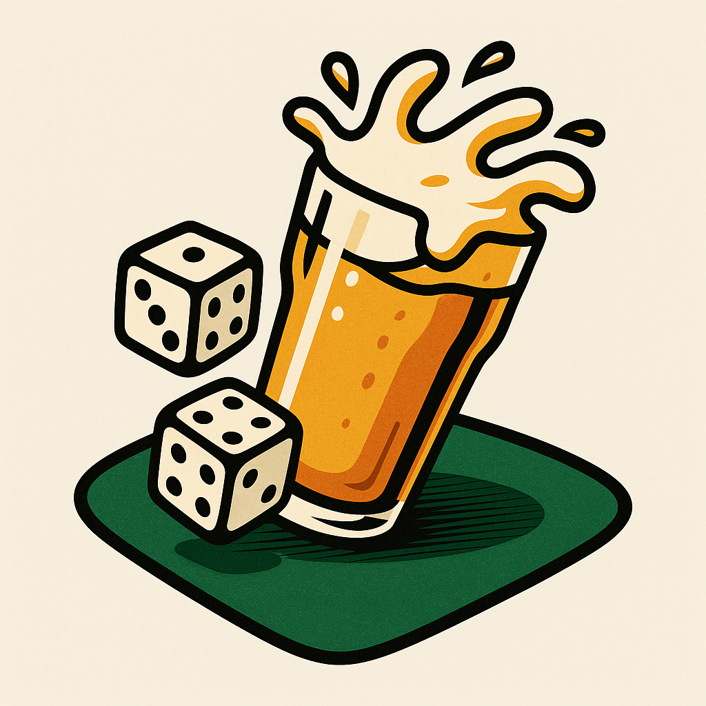
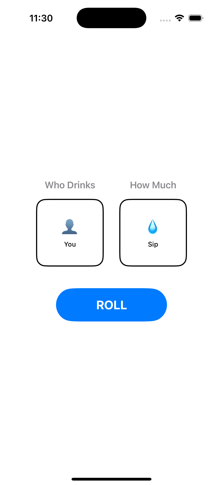

 

# DrunkenDice 🎲🍺



A fun iOS drinking game app built with SwiftUI that brings excitement to your party with animated dice rolls!

DrunkenDice uses two dice to determine drinking rules - simply tap the **ROLL** button and watch the dice animate for 1-3 seconds before revealing your fate!

## How to Play

DrunkenDice uses two dice to determine drinking rules:

- **Who Drinks** (Left Die): Determines who takes the drink
  - You
  - Someone you pick
  - Person to your left
  - Person to your right
  - Everyone
  - No one

- **How Much** (Right Die): Determines the amount to drink
  - Sip
  - Half your drink
  - Finish your drink (appears twice as often)
  - Two drinks
  - Three drinks

Simply tap the **ROLL** button and watch the dice animate for 1-3 seconds before revealing your fate!

## Features

- 🎲 **Animated Dice Rolling**: Smooth animations that cycle through different results
- 📱 **Native iOS Design**: Built with SwiftUI for a modern, responsive interface
- 🎯 **Weighted Results**: "Finish your drink" appears more frequently for extra excitement
- 🔄 **Random Animation Duration**: Each roll takes 1-3 seconds for suspense
- 📐 **Universal Support**: Works on both iPhone and iPad

## Requirements

- iOS 18.5+
- Xcode 15+
- iPhone or iPad

## Installation

1. Clone this repository
2. Open `DrunkenDice.xcodeproj` in Xcode
3. Build and run on your iOS device or simulator

## Development

### Build Commands
```bash
# Build the project
xcodebuild -project DrunkenDice.xcodeproj -scheme DrunkenDice build

# Or use Xcode shortcuts:
# Build: ⌘+B
# Run: ⌘+R
```

### Architecture

The app follows MVVM architecture with clean separation:

- **Models** (`DiceModels.swift`): Game logic and dice definitions
- **Views** (`DiceView.swift`, `ContentView.swift`): SwiftUI interface components
- **ViewModel** (`DiceRoller.swift`): Game state management and animations

## Disclaimer

Please drink responsibly and know your limits. This app is intended for entertainment purposes only for adults of legal drinking age.

## License

[Add your license here]
